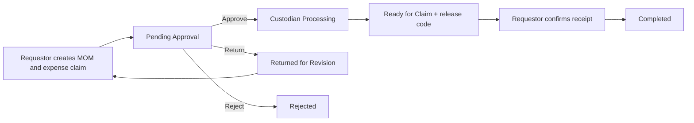
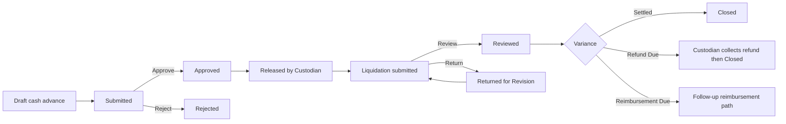
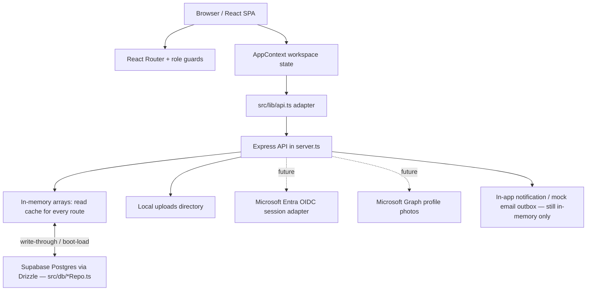
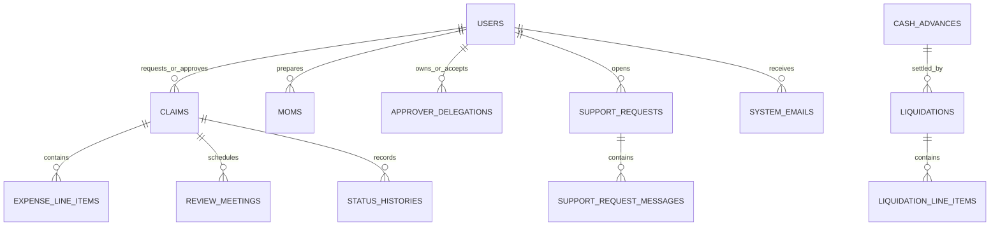

# Sales Reimbursement System

Sales Reimbursement System is a role-based web application for managing sales reimbursements, transport reimbursements, cash advances, liquidations, client meeting records, approvals, release processing, receipts, and support requests.

## Project folders

- `frontend/` — React/Vite SPA source, static assets, and frontend build output.
- `backend/` — Express API, server/domain code, database repositories, Drizzle migrations, and backend build output.
- `test/` — integration and shared verification tests.

The repository keeps one root `package.json` and test configuration so the existing `npm run dev`, test, build, and database commands continue to work without installing dependencies twice.

It is a high-fidelity **prototype and demonstration system**. Core workflows are functional against an Express backend backed by a real Supabase Postgres database (see [Database persistence](#database-persistence)), but identity is still demo-only (no Microsoft Entra yet). It is not yet safe for real employee, client, or financial data.

> **Source of truth:** this README reflects the local codebase as reviewed on 2026-08-04, after a design-consistency/workflow-hardening pass and a database-persistence migration (see [Recent hardening pass](#recent-hardening-pass-2026-08-04) and [Database persistence](#database-persistence)). The current implementation takes precedence over older screenshots, historical audits, and previous GitHub snapshots.

## Contents

- [System at a glance](#system-at-a-glance)
- [Recent hardening pass (2026-08-04)](#recent-hardening-pass-2026-08-04)
- [Database persistence](#database-persistence)
- [Current implementation status](#current-implementation-status)
- [Roles and access](#roles-and-access)
- [User experience and navigation](#user-experience-and-navigation)
- [Business workflows](#business-workflows)
- [Architecture](#architecture)
- [Technology stack](#technology-stack)
- [Design system and UI conventions](#design-system-and-ui-conventions)
- [Data model](#data-model)
- [Authentication, demo mode, and Microsoft](#authentication-demo-mode-and-microsoft)
- [Global search](#global-search)
- [API reference](#api-reference)
- [Local development](#local-development)
- [Testing](#testing)
- [Deployment and production cutover](#deployment-and-production-cutover)
- [Troubleshooting](#troubleshooting)
- [Handoff checklist](#handoff-checklist)

## System at a glance

### Business purpose

The system gives sales teams one place to submit, approve, disburse, and track expense-related requests. It supports the business trail from a client meeting through an expense request and payment confirmation, while preserving an activity history and notification trail.

### Transaction types

| Type | Purpose | Typical lifecycle |
|---|---|---|
| Reimbursement | Repay an employee for completed business expenses. | Draft → Pending Approval → Processing → Ready for Claim → Completed |
| Transport reimbursement | A reimbursement whose expense category/type is transport. | Same reimbursement workflow |
| Cash advance | Provide funds before a planned business expense. | Draft → Submitted → Approved → Released → Liquidated |
| Liquidation | Settle a released cash advance against actual expenses. | Draft → Submitted → Reviewed → Closed, or Returned for Revision |
| MOM / LOA | Record meeting details or an agreement supporting business activity. | Draft/Completed; may be linked to a reimbursement |

### Main capabilities

- Role-based dashboards for Requestor, Approver, Custodian, Finance, and Administrator.
- Claim submission with expense line items, receipts, client/contact information, and configurable fields.
- Minutes of Meeting (MOM) and Letter of Agreement (LOA) records, including file upload.
- Approval, rejection, revision, delegation, transfer, and stale-approver handling.
- Review meeting scheduling and response actions.
- Custodian release processing and requestor receipt confirmation using a release code.
- Cash advance and liquidation tracking, including refund and reimbursement-due outcomes.
- Receipt archive, activity history, notifications, mock email outbox, support tickets, and role dashboards.
- Administrative management for users, companies, master data, fields, reporting, imports, and audit/activity views.
- Permission-aware global search with partial, fuzzy, token, abbreviation, and keyboard support.

## Recent hardening pass (2026-08-04)

A consistency-and-hardening pass was applied on top of the `docs/SYSTEM-AUDIT-2026-08-03.md` findings. No backend was added (still in-memory, still demo identity) and all demo/seed data was intentionally preserved. Changes:

| Change | What it does | Why |
|---|---|---|
| **Unified design tokens** | Radii (`rounded-btn`/`rounded-container`/`rounded-input`), the form-control border (`brand-field-border`), the success color, and a new modal `scrim` token are now referenced everywhere instead of hardcoded hex / arbitrary `rounded-[Npx]` values. | Removed the three-way drift between Material-3 tokens, `brand-*` tokens, and raw Tailwind/hex. See [Design system and UI conventions](#design-system-and-ui-conventions). |
| **Fixed modal backdrop** | `bg-scrim/40` referenced an undefined token, so dialogs had no dim overlay (blur only). Added `--color-scrim`; backdrops now dim correctly. | Visible bug. |
| **Reimbursement workflow guards** | `POST /api/claims/:id/approve` now requires `Pending Approval`; `PUT /api/claims/:id/claim-code` requires `Processing`/`Ready for Claim`; `POST /api/claims/:id/ready-for-claim` requires `Processing`. Out-of-order/replay calls return `409`. | Audit High findings — Cash Advance/Liquidation already did this; Reimbursement did not. |
| **Secure release codes** | Release/claim codes now come from `crypto.randomBytes` over an unambiguous alphabet (no `0/O/1/I`) instead of `Math.random()`. | Audit High finding. Expiry, hashing, and throttling are still owed (see [Known limitations](#known-limitations-and-technical-debt)). |
| **Honest profile page** | Settings → Profile no longer shows fake "saved" / "photo updated" toasts. Fields are read-only with a note that they sync from the directory / Microsoft Entra once connected. | Audit Medium finding — the controls never persisted anything. |
| **Regression tests** | Added `test/workflow-guards.test.ts` locking in the new transition guards and code format. Suite is now **67 tests across 10 files**. | Audit asked for replay/out-of-order coverage. |

These are hardening steps, not a production sign-off. The [production blockers](#deployment-and-production-cutover) (real auth, durable storage, dependency CVEs) are unchanged.

## Database persistence

The former P0 blocker — "all state is in-memory, a restart loses everything" — is now largely resolved. The app runs against a real **Supabase Postgres** database via **Drizzle ORM**, with a schema of 25 tables (`src/db/schema.ts`).

### How it works

The server does **not** read from Postgres on every request. Each domain's `let claims: Claim[] = []`-style module array in `server.ts` remains the in-process read cache every existing route already used — that design choice kept this migration a bounded, reviewable series of additions instead of a rewrite of ~90 route handlers. On top of that cache:

- **Every write goes through to Postgres.** Creating, approving, releasing, editing — any route that mutates a record now also calls a `persist*()` function (in `src/db/*Repo.ts`) that upserts the same row into Postgres, in addition to the in-memory mutation it already did.
- **Boot-time loading is gated by `DEMO_MODE`.** While `DEMO_MODE=true` (the default, used for presenting), the app behaves exactly as it always has: `seedYearOfData()` regenerates a fresh randomized dataset in memory on every restart, and real writes land in Postgres in the background without being read back — so the demo experience is completely unchanged. The moment `DEMO_MODE=false` (real deployment posture), boot instead **loads every domain from Postgres** and skips reseeding, so real data survives a restart. This split exists because the demo seed generator is a large, tightly-coupled function (~1,400 lines) that was too risky to thread a bypass through in this pass — see `docs/DATABASE-MIGRATION.md` for the follow-up.
- **Repo modules, one per domain**, each with the same shape: a row↔domain-object mapper, `persistX()` upsert functions, and a `loadXFromDb()` boot-time loader.

| Repo module | Domain | Tables |
|---|---|---|
| `src/db/usersRepo.ts` | Users | `users` |
| `src/db/coreLoopRepo.ts` | Reimbursement core loop | `moms`, `claims`, `expense_line_items`, `approvals`, `status_histories` (claim-scoped) |
| `src/db/cashAdvanceRepo.ts` | Cash advances & liquidations | `cash_advances`, `liquidations`, `liquidation_line_items`, `status_histories` (cash-advance/liquidation-scoped) |
| `src/db/referenceDataRepo.ts` | Admin reference data | `companies`, the six master-data catalogs (`departments`, `cost_centers`, `business_units`, `branches`, `project_codes`, `vendors`), `field_definitions`, `system_settings` |
| `src/db/workflowExtrasRepo.ts` | Delegations, review meetings, support | `approver_delegations`, `review_meetings`, `support_requests`, `support_request_messages`, `status_histories` (delegation-scoped) |

### What's still in-memory only (deliberately)

| Domain | Why it's excluded |
|---|---|
| Mock email/Teams outbox (`emails`) | Ephemeral notification log, not business data. Real delivery is a separate, unstarted production item (see [Known limitations](#known-limitations-and-technical-debt)). |
| `last_seen` (per-user "have I viewed this" state) | Pure UI convenience state; safe to lose on restart. |
| `import_batches` | Admin historical-import log; low value relative to also migrating the import records it summarizes. |

### Known gaps and lessons learned

- **The demo seed generator is not gated.** `seedYearOfData()`'s claims/MOMs/cash-advances/etc. still regenerate fresh in memory on every restart while `DEMO_MODE=true`. Real transactions submitted during a demo session persist correctly in the background; they're just not what's visibly shown after a restart until `DEMO_MODE=false`. See `docs/DATABASE-MIGRATION.md` for the specific follow-up.
- **`status_histories` is a shared table** across claims, cash advances, liquidations, and delegations — one `_id` column per row is set, matching the in-memory union shape. The demo seed generator calls the same history-logging helpers real routes use for its own (never-persisted) demo records; a module-level suppression flag (`suppressHistoryPersistence` in `server.ts`) is set around every `seedYearOfData()` call so the seed's history writes don't try to FK-reference rows that were never sent to Postgres.
- **Ordering matters for fire-and-forget history logging.** History rows are logged as "fire and forget" (not awaited) so the ~15 call sites across the codebase didn't all need to become `async`. This means the *parent* row (claim, cash advance, liquidation, delegation) must always be persisted — awaited — **before** the history-logging call that references it, or the background insert can race ahead and hit a foreign-key violation. Every route follows this order; it's called out inline where it isn't obvious.
- **Three schema gaps were found and fixed** by cross-checking `src/db/schema.ts` against the fields `server.ts` actually reads/writes: `Mom.document_type` (MoM vs LOA), `Liquidation.refundMethod`, and `systemSettings.categoryLimits` were all real, mutable fields with no column. All three now have columns.
- **Two real bugs were caught by live testing against Postgres**, not by lint or the unit test suite — both were foreign-key races only visible against a real database: history-before-parent-row race conditions (see above), and an empty-string-vs-`null` mapping bug (`mom_id: ca.momId || ''` was sent as a literal, nonexistent foreign key instead of `NULL`; fixed by using `|| null` instead of `?? null` in `coreLoopRepo.ts`'s mapper).

### Hosting note: this design requires a single persistent process

The in-memory-cache-plus-write-through design is correct **only** when the app runs as one continuous Node process (e.g. Render, Railway, Fly.io — `npm start` already binds to `process.env.PORT`, ready for this). It is **not** correct on serverless platforms like Vercel: each cold start (and each concurrent warm instance) gets its own independent copy of the in-memory cache, so writes from one instance aren't visible to another without re-reading from Postgres on every request — which this design intentionally doesn't do, to avoid a much larger rewrite. Do not deploy this app to Vercel serverless functions without either (a) switching hosting to a persistent-process platform, or (b) completing the larger "no in-memory cache, read Postgres on every request" rewrite this migration deliberately avoided.

### Row-Level Security (RLS)

Supabase's dashboard will flag every table as "RLS Disabled" (its standard linter). This is expected and low-risk for the current architecture: the app never uses the Supabase client SDK or exposes an anon/service key to the browser — the only thing that ever talks to Postgres is the Express backend, over a direct connection string, using the table-owner Postgres role (which bypasses RLS regardless of whether it's enabled). Enabling RLS with no permissive policies (default-deny) is still recommended as defense-in-depth — it costs nothing today and protects against an anon/service key accidentally leaking to the frontend later — but it is not fixing an active vulnerability in the current design.

## Current implementation status

| Area | Status | What exists today | Before real deployment |
|---|---|---|---|
| Frontend | Implemented | React SPA with role routes, responsive layout, error/loading states, forms, dashboards, and search. | Accessibility review and final UAT. |
| Core workflows | Implemented for demo | Reimbursement, cash advance, liquidation, review meeting, delegation, release, and support flows are server-backed. | Exercise business rules against real data and policies. |
| Authentication | Demo only | Role/account launcher stores an identity per browser tab and sends `X-User-Id`. | Microsoft Entra OIDC, signed sessions, token validation, and removal of temporary identity headers. |
| Authorization | Partial / prototype | Server routes generally check the current mock identity; frontend adds route guards and scoped views. | Security review and authoritative server-side policy coverage. |
| Data persistence | Implemented (demo-mode caveat) | Supabase Postgres via Drizzle; every write persists. Boot-time loading only activates at `DEMO_MODE=false` — see [Database persistence](#database-persistence). | Gate the demo seed generator too (currently regenerates fresh data in memory every restart while `DEMO_MODE=true`, by design). |
| Demo data | Implemented | Fake users, reference data, optional automatic year seed, and admin seed/reset controls. | Set `DEMO_MODE=false` only after real identity and persistence exist. |
| Microsoft sign-in | Scaffolded | Login UI, `/api/auth/config`, config variables, and a stable `/api/auth/microsoft/start` placeholder. | OIDC adapter, Entra app registration, sessions, and callbacks. |
| Microsoft profile photos | Planned | User model has `avatar_url`; current avatars are local demo images. | Microsoft Graph permission, backend fetch/cache/proxy, fallback initials. |
| Notifications | Implemented for demo | In-app bell, outbox records, read state, and client-CC awareness messages. | Real email provider and production notification delivery. |
| Uploads | Prototype | Local disk upload endpoint; JPG, PNG, GIF, WEBP, PDF, DOC, and DOCX accepted up to 10 MB. | Durable object storage and per-resource authorization. |
| Search | Implemented | Client-side role-filtered search across claims, meetings, receipts, and support tickets. | Server-side/indexed search for large datasets. |
| Reporting | Implemented for demo | Role dashboards, analytics, activity, finance, and admin reports. | Validate metrics against the production data source. |

## Roles and access

| Role | Core responsibilities | Key access |
|---|---|---|
| Requestor | Creates and tracks their requests; confirms payment receipt. | Own claims, MOMs/LOAs, receipts, payouts, calendar, support, notifications, settings. |
| Approver | Reviews direct-report or delegated work; can submit own claims. | Approval queue, own claims, eligible team records, delegated approvals, review meetings, receipts, calendar, settings. |
| Custodian | Releases approved work and handles payment/refund processing. | Disbursement queues, ready-to-claim queue, transaction history, custodian analytics, support/settings. |
| Finance | Read-only financial visibility from approval onward. | Approved records, their receipts, paid/completed transactions, finance analytics, support/settings. |
| Administrator | Maintains the system configuration and oversight views. | Users, companies, master data, fields, imports, reporting, system activity, audit/email views, demo data while demo mode is enabled. |

Notes:

- An Approver cannot approve their own claim. Delegates can act only for active delegated approvers.
- Frontend route restrictions are in `src/App.tsx`; backend checks are in `server.ts`. Do not treat a hidden UI control as a security boundary.
- The application role is currently assigned by the internal user record. Microsoft sign-in, once implemented, should identify a user rather than automatically determine their role unless the business adopts an Entra group/app-role mapping policy.

## User experience and navigation

### Layout

The application shell consists of:

- A role-scoped sidebar for navigation and the current user identity.
- A top bar with global search, notifications, help, and a compact profile menu.
- A profile menu containing account context, Account settings, and Sign out. Sign out intentionally lives here rather than occupying top-bar space.
- Responsive cards, tables, filters, modals, pagination, empty states, confirmation dialogs, and status badges.

The primary desktop targets are **1366×768** and **1920×1080**. On narrow viewports the header search becomes an icon and opens a full-width result panel below the top bar.

### Routes

| Route | Purpose | Allowed roles |
|---|---|---|
| `/` | Role dashboard; Admin receives Admin Dashboard. | All signed-in roles |
| `/claims`, `/claims/:id`, `/claims/new` | Claim list, detail, and creation. | Requestor, Approver; Finance can view list/detail where allowed |
| `/payouts` | Requestor payout/receipt tracking. | Requestor, Approver |
| `/moms`, `/moms/new`, `/moms/:id` | Minutes and agreements. | Requestor, Approver |
| `/receipts` | Receipt archive. | Requestor, Approver, Finance |
| `/calendar` | Meetings/calendar. | Requestor, Approver |
| `/approvals` | Approval queue. | Approver |
| `/disbursements`, `/ready-to-claim` | Custodian processing queues. | Custodian |
| `/transactions` | Transaction history. | Custodian, Finance |
| `/custodian/analytics`, `/finance/analytics` | Role analytics. | Custodian / Finance respectively |
| `/notifications`, `/support`, `/settings` | Shared account/support areas. | All signed-in roles |
| `/admin/users`, `/admin/companies`, `/admin/import`, `/admin/reports`, `/admin/activity` | Administration. | Admin |

Unknown routes return to `/`. Route components below the shell are lazily loaded to reduce the initial bundle.

### Key UI source locations

| Area | Main files |
|---|---|
| Application routes and role guards | `src/App.tsx` |
| Global server-backed state | `src/components/AppContext.tsx` |
| Layout, navigation, profile, notifications | `src/components/layout/` |
| Global search | `src/components/layout/GlobalSearch.tsx`, `src/lib/globalSearch.ts` |
| Login and demo launcher | `src/pages/Login.tsx` |
| Workflow pages | `src/pages/requestor/`, `src/pages/approver/`, `src/pages/custodian/`, `src/pages/finance/`, `src/pages/shared/` |
| Admin pages | `src/pages/admin/` |
| UI primitives | `src/components/ui/` |

## Business workflows

### Reimbursement



1. A Requestor creates an expense claim, generally with a MOM/LOA context and line-item receipts.
2. The server routes it to the requestor’s approver, considering active delegation and stale-approver logic.
3. The Approver approves, returns for revision, or rejects the claim. Review meeting actions are available where applicable.
4. A Custodian processes approved work, records release/payment information, and makes it ready for claim.
5. The Requestor confirms receipt with the release code. This final confirmation is intentionally not a custodian action.

### Cash advance and liquidation



Liquidation line items calculate the total spent and variance. A `RefundDue` result requires custodian collection; a `ReimbursementDue` result can create a follow-up reimbursement path. Confirm behavior against the server before changing these rules.

### Client CC awareness

When the Requestor checks the client-CC option on a MOM/claim, a client email is required. The system records that the client was CCed and creates awareness notifications for the Requestor and Approver as applicable. Current email/outbox records are system data, not delivery through an external mail provider.

### Delegation and stale approvers

- An Approver can create a delegation for a date range; the designated delegate can accept or decline it.
- Active delegation is considered during approval visibility and routing.
- If a reporting relationship changes while a claim is pending, the system can mark the claim’s approver as stale and support transfer/reassignment paths.
- See `docs/hierarchy-sync-design.md` for the rationale and model.

### Status model

| Domain | Important statuses |
|---|---|
| Reimbursement | Draft, Pending Approval, Review Meeting Scheduled, Approved, Processing, Ready for Claim, Completed, Rejected, Returned for Revision |
| Cash advance | Draft, Submitted, Approved, Rejected, Released, Liquidated |
| Liquidation | Draft, Submitted, Returned for Revision, Reviewed, Closed |
| Review meeting | PendingConfirmation, Confirmed, DeclineRequested, Completed |
| Support | Open, In Progress, Resolved |
| Delegation | Pending, Active, Declined, Expired, Cancelled |

The client uses a unified `ClaimStatus`; the server maintains separate reimbursement, cash advance, and liquidation representations. `src/lib/api.ts` is the adapter that translates between them.

## Architecture



See [Database persistence](#database-persistence) for how the write-through/boot-load split actually works and why the in-memory arrays are still there by design, not as leftover prototype code.

### Frontend-to-server model adapter

The server and UI deliberately use different domain shapes:

| Server | Frontend |
|---|---|
| Separate reimbursement claims, cash advances, and liquidations | A unified `Claim` with a `type` discriminator |
| Mostly snake_case wire fields | camelCase UI fields |
| Separate status enums | One `ClaimStatus` enum |
| Separate master-data collections | Unified frontend master-data representation |

`src/lib/api.ts` is the boundary that converts objects and statuses. Avoid adding direct raw API shape assumptions into pages; new API work should be normalized in this adapter.

### State loading and cross-tab behavior

`AppContext` loads the workspace, gates rendering while loading, exposes mutations, and periodically refreshes visible tabs. Demo identity is stored in **sessionStorage**, not a shared browser-wide store, so a presentation can keep separate Requestor, Approver, Custodian, Finance, and Admin tabs open at the same time. They share the same in-memory backend, so updates are visible after polling, focus, or refresh.

## Technology stack

Everything runs in a single Node process: `tsx server.ts` serves the Express API and, in development, mounts Vite as middleware so the React app and API share one origin/port (3000). There is no separate frontend server to run.

| Layer | Technology | Version (see `package.json`) | Notes |
|---|---|---|---|
| Language | TypeScript | ~5.8 | Frontend and backend. **Not** in `strict` mode — a green `tsc` does not prove runtime correctness. |
| UI framework | React | 19 | Function components + hooks; route components are lazily loaded (`React.lazy`). |
| Routing | React Router | 7 | Role-aware routes and client-side guards in `src/App.tsx`. |
| Build tool | Vite | 6 | Dev middleware + production frontend build. |
| Styling | Tailwind CSS | 4 | Configured via `@theme` tokens in `src/index.css` (no `tailwind.config.js`). `clsx` + `tailwind-merge` via the `cn()` helper in `src/components/ui/Button.tsx`. |
| Icons/fonts | Material Symbols, Hanken Grotesk, JetBrains Mono | — | Loaded in `index.html`. |
| Charts | Recharts | 3 | Finance/Custodian/Admin/team analytics. Shared theme in `src/lib/chartTheme.ts`. |
| Server | Express | 4 | Entire REST API in `server.ts` (~6.2k lines). |
| Server middleware | Helmet, CORS, Multer | — | Helmet on (CSP intentionally disabled pending a final policy); Multer handles uploads. |
| Identity (demo) | `X-User-Id` header | — | Prototype seam only — trusts a client-supplied header. Replace before production. |
| Persistence | Supabase Postgres via Drizzle ORM + `pg` | 0.45 / 8 | Schema in `src/db/schema.ts` (25 tables). Live and wired — every write persists; see [Database persistence](#database-persistence) for the in-memory-cache-plus-write-through architecture and its hosting constraint. |
| PDF/doc export | jsPDF (+ html2canvas) | 3 | `src/lib/*Export.ts`, `documentExport.ts`. See dependency CVE note below. |
| IDs | `uuid` | 14 | |
| Testing | Vitest + `tsc` | 4 / 5.8 | 97 tests / 14 files (2026-08-06). Almost all run without `DATABASE_URL`, verifying the in-memory code paths only; `test/db-persistence.test.ts` is the one exception — it points the repo write/read functions at pg-mem (an in-process schema-accurate Postgres emulator, no Docker needed) built from the real migration files, so the DB path now has automated coverage too. Still not a substitute for the live Supabase verification noted in [Database persistence](#database-persistence). |
| Bundling (server) | esbuild | 0.25 | `npm run build` → `dist/server.cjs`. |
| CI | GitHub Actions | — | `.github/workflows/ci.yml`: `npm ci`, type-check, test, build. |
| Deploy target | A persistent-process host (Render/Railway/Fly.io) | — | `npm start` binds to `process.env.PORT`, ready for a standard web-service setup. **Not** Vercel serverless functions (`vercel.json`/`api/` are present but incompatible with the current persistence design — see [Database persistence](#database-persistence)). |

### Repository layout

| Path | Contents |
|---|---|
| `server.ts` | The entire Express API, in-memory data stores, demo seed, and dev Vite middleware. |
| `src/main.tsx`, `src/App.tsx` | SPA entry and route table with role guards. |
| `src/components/ui/` | Design-system primitives: `Button`, `Card`, `Input`/`Select`/`Label`, `StatusBadge`, `KPICard`, `Pagination`. |
| `src/components/layout/` | App shell: `Sidebar`, `Topbar`, `Layout`, `GlobalSearch`, `BackButton`. |
| `src/components/shared/` | Cross-page pieces: `Modal`, `ConfirmModal`, `Toast`/`ToastContext`, `ErrorBoundary`, action-button clusters, analytics widgets, empty/error/skeleton states. |
| `src/pages/` | Screens grouped by role (`requestor/`, `approver/`, `custodian/`, `finance/`, `admin/`) plus `shared/`. |
| `src/lib/` | Framework-free logic: `api.ts` (the server↔UI adapter), analytics, exports, money/date helpers, policy, search. Most unit tests live beside these. |
| `src/db/` | Drizzle schema (`schema.ts`), client factory (`index.ts`), and one persistence repo module per domain (`usersRepo.ts`, `coreLoopRepo.ts`, `cashAdvanceRepo.ts`, `referenceDataRepo.ts`, `workflowExtrasRepo.ts`) — live, see [Database persistence](#database-persistence). |
| `src/index.css` | The **single** source of design tokens (`@theme`) and global/print styles. |
| `docs/` | Audits, handoff notes, user manual, migration/cutover plans. |
| `test/` | Server-level E2E/integration tests against the real Express app. |

## Design system and UI conventions

All visual tokens live in one place — the `@theme` block of `src/index.css` — and Tailwind 4 generates utilities from them. **Add or change a token there; do not hardcode hex or arbitrary `rounded-[Npx]` values in components.** The 2026-08-04 pass consolidated the codebase onto these tokens.

### Color

Three token families coexist by design; use them in this order of preference:

1. **Semantic / Material-3 tokens** — `primary`, `on-primary`, `surface`, `surface-container-*`, `on-surface`, `on-surface-variant`, `outline`, `outline-variant`, `error`, `success`, `secondary`, `tertiary`. Prefer these for foreground/background/state.
2. **`brand-*` tokens** — `brand-canvas` (page background), `brand-slate` (default text), `brand-border` (structural borders on cards, tables, dividers), `brand-field-border` (the slightly stronger border reserved for interactive form controls — inputs, selects, textareas), `brand-table-header`, `brand-row-hover`, `brand-primary`.
3. **`scrim`** — dark overlay behind modals/dialogs; apply with opacity, e.g. `bg-scrim/40`.

Status colors in `StatusBadge` intentionally use the raw Tailwind palette (amber/blue/teal/rose/…) because each workflow state needs a distinct, recognizable hue — that is a deliberate exception, not drift.

### Radius

Use the three semantic radius utilities (backed by `--radius-*` tokens), not arbitrary pixel values:

| Utility | Token | Value | Use for |
|---|---|---|---|
| `rounded-input` | `--radius-input` | 6px | Inputs, selects, small chips, badges |
| `rounded-btn` | `--radius-btn` | 10px | Buttons and button-sized controls |
| `rounded-container` | `--radius-container` | 14px | Cards, modals, large containers |

### Typography and spacing

Type scale tokens (`text-display`, `text-headline-lg/md`, `text-body-lg/base/sm`, `text-label-md/sm`, `text-mono-data`) and matching `font-*` weights are defined in `@theme`; use them instead of raw `text-[NNpx]`. Layout tokens `--spacing-sidebar` and `--spacing-topbar` define the shell. Fonts: **Hanken Grotesk** for UI, **JetBrains Mono** for reference numbers and codes.

### UI primitives

Build screens from `src/components/ui/` primitives (`Button`, `Card`/`CardHeader`/`CardContent`, `Input`/`Select`/`Label`, `StatusBadge`, `KPICard`, `Pagination`) and `src/components/shared/` pieces (`Modal`, `ConfirmModal`, toasts, empty/error/skeleton states) rather than re-styling from scratch — this is what keeps the system visually consistent. The `cn()` helper (clsx + tailwind-merge) resolves className conflicts when overriding a primitive.

> **Login is a deliberate exception.** `src/pages/Login.tsx` uses bespoke, hardcoded colors/gradients (including the official Microsoft logo hues) to look branded rather than templated. Leave its one-off values alone unless you are intentionally reworking the login art.

## Data model

The domain definitions are in `src/types.ts`; server wire types are in `src/serverTypes.ts`. The Drizzle schema in `src/db/schema.ts` (25 tables, Supabase Postgres) is live — see [Database persistence](#database-persistence) for how `server.ts` reads/writes through it.



| Entity | Purpose |
|---|---|
| User | Employee identity, application role, org relationship, notification preferences, avatar, future Entra join keys. |
| Claim | Unified frontend view of reimbursement/cash advance/liquidation records. |
| Expense line item | Vendor, category, date, amount, payment method, business purpose, receipt, OR number. |
| MOM / LOA | Meeting/client record, contact person/designation/email, CC flag, content, source file, and custom fields. |
| Review meeting | Proposed/confirmed/declined review schedule linked to a claim. |
| Delegation | Date-bound approval delegation with acceptance state. |
| Status history | Audit-style workflow events and reasons. |
| System email | Mock outbox / in-app notification record with recipient and read state. |
| Support request | Ticket, priority, status, related entity, and message thread. |
| Company and master data | Company directory plus departments, cost centers, business units, branches, project codes, and vendors. |
| Field definition | Admin-configured dynamic fields for MOM/claim forms. |

## Authentication, demo mode, and Microsoft

### Current demo authentication

The login screen is Microsoft-first visually, but it provides demo access while Microsoft setup is pending. A user chooses a role and account, then **Open demo in new tab** creates a new sessionStorage-backed tab. There are no passwords, sessions, tokens, or real identity validation.

The API currently trusts `X-User-Id`. This is a prototype seam, not production authentication. It must be replaced before real deployment.

### Demo controls

| Variable | Default in `.env.example` | Purpose |
|---|---:|---|
| `DEMO_MODE` | `true` | Master switch for fake users/reference data, demo endpoints, seed/reset tools, and Demo Data UI. |
| `AUTH_MODE` | `demo` | Requests demo or Microsoft mode; demo mode remains authoritative while enabled. |
| `ENABLE_DEMO_LOGIN` | `true` | Enables the demo account launcher. |
| `VITE_ENABLE_DEMO_LOGIN` | `true` | Frontend-facing defense-in-depth flag. |
| `AUTO_SEED` | `true` | Seeds demonstration data at startup while demo mode is enabled. |

Set `DEMO_MODE=false` only after persistent data and real login exist. It disables fake identity/data bootstrap, demo account access, seed/reset endpoints, automatic seed, and the Admin Demo Data tab. It does **not** install a database or authenticate anyone by itself.

### Microsoft Entra ID integration status

Implemented preparation:

- `GET /api/auth/config` reports demo/Microsoft capability without exposing secrets.
- `GET /api/auth/microsoft/start` is a stable future OIDC entry point.
- User schema contains `entra_object_id` and `user_principal_name` fields.
- Login UI provides a Microsoft sign-in entry and clearly falls back to demo accounts when unconfigured.

Still required:

1. Entra tenant ID, client/application ID, approved redirect URI, secret/certificate, and assignment policy from IT.
2. Authorization-code OIDC flow with PKCE, state, nonce, issuer/audience/signature validation, and server-side session storage.
3. `HttpOnly`, `Secure`, `SameSite` session cookies, logout, expiry, and account-removal handling.
4. Lookup from validated Entra `oid` to the internal user record.
5. Removal of `X-User-Id` and per-resource upload authorization.

### Profile pictures

Profile pictures do not automatically come from Microsoft today. The current avatars are local demo files. Entra ID token claims identify a person but do not include profile-photo bytes. A production implementation should request approved Microsoft Graph photo permission, fetch a fixed-size photo such as `/me/photos/96x96/$value` through the backend, cache/proxy it to an internal `avatar_url`, and fall back to initials when no photo exists. Never place an access token or expiring Graph URL directly in an image element.

## Global search

The top-bar search is client-side and searches only records that the signed-in role is allowed to open.

| Search behavior | Details |
|---|---|
| Record types | Claims, meetings/agreements, receipt line items, and support tickets. |
| Fields | Reference, client, purpose, requester, vendor, category, receipt name/OR number, contact, status, and ticket details. |
| Matching | Case, punctuation, spacing, and accents are normalized. Terms can appear in any order. |
| Fuzzy tolerance | One typo for medium words; two for longer words; adjacent transpositions such as `jnae` → `jane`. |
| Abbreviations | `CA`, `LIQ`, `MOM`, `LOA`, `REIM`, `REQ`, and `SUPP` expand to workflow concepts. |
| Keyboard | `Ctrl+K` focuses search; arrows choose; Enter opens; Escape closes. |
| Result limit | Top 10 ranked results. |
| Scale limitation | The full workspace is already loaded in the browser. Move matching/indexing to the server for large production datasets. |

Examples: `reim 124`, `client jane`, `reimbursmnt`, `CA travel`, and `MOM client`.

## API reference

All routes are implemented in `server.ts`. Most protected routes rely on the temporary `X-User-Id` header. This table is a handoff map; inspect request validation in the corresponding route before integrating an external client.

| Area | Main endpoints |
|---|---|
| Capability/auth | `GET /api/auth/config`, `GET /api/auth/microsoft/start`, `GET /api/demo-users`, `POST /api/login`, `GET /api/me`, `PUT /api/me/notification-prefs` |
| Uploads | `POST /api/upload`, `GET /uploads/:filename` |
| Users/admin settings | `GET /api/users`, `PUT /api/users/:id`, `GET/PUT /api/admin/settings` |
| Companies/master data | `GET/POST/PUT /api/companies`, `POST /api/companies/import`, `GET/POST/PUT` master-data catalog routes, `GET/POST/PUT /api/field-definitions` |
| MOM/receipts | `GET/POST/PUT /api/moms`, `GET /api/moms/:id`, `POST /api/moms/:id/send`, `GET /api/receipts` |
| Reimbursements | `GET/POST /api/claims`, `GET /api/claims/:id`, `POST /api/claims/:id/approve`, `PUT /api/claims/:id/resubmit`, `POST /api/claims/:id/transfer-approver`, `POST /api/claims/:id/ready-for-claim`, `POST /api/claims/:id/claim` |
| Review meetings | `GET /api/review-meetings`, `POST /api/review-meetings/:id/confirm`, `POST /api/review-meetings/:id/decline`, `PUT /api/review-meetings/:id/reschedule` |
| Custodian/activity | `POST /api/custodian/claims/:id/decision`, `PUT /api/claims/:id/claim-code`, `GET /api/history`, `GET /api/system-activity`, `GET /api/activity/status`, `POST /api/activity/seen` |
| Notifications | `GET /api/outbox`, `PUT /api/outbox/read` |
| Cash advances | `GET/POST /api/cash-advances`, `GET/PUT /api/cash-advances/:id`, `POST /:id/submit`, `POST /:id/approve`, `POST /:id/release` |
| Liquidations | `GET/POST /api/liquidations`, `GET /api/liquidations/:id`, line-item create/update/delete routes, `POST /:id/submit`, `POST /:id/review`, `POST /:id/collect-refund` |
| Delegations | `GET/POST /api/delegations`, `POST /:id/accept`, `POST /:id/decline`, `POST /:id/cancel`, `PUT /api/claims/:id/reassign` |
| Support | `GET/POST /api/support`, `GET /api/support/:id`, `POST /api/support/:id/messages`, `PUT /api/support/:id` |
| Analytics/import/demo | `GET /api/analytics/summary`, `GET/POST /api/imports`, `POST /api/admin/seed`, `POST /api/admin/seed-year`, `POST /api/admin/reset` |

Demo seed/reset routes return unavailable when `DEMO_MODE=false`.

## Local development

### Prerequisites

- Node.js 18 or newer (Node 22 typings are included in development dependencies).
- npm.
- A Postgres connection string (e.g. a free Supabase project) in `.env` as `DATABASE_URL`, using the **session pooler** connection (not the direct `db.*.supabase.co` host, which is IPv6-only and fails to resolve on many networks; not the transaction pooler, which this app doesn't need since it runs as one persistent process). Without `DATABASE_URL` set, the app still runs — it just stays fully in-memory, matching pre-persistence behavior, which is fine for quick UI work but means `npm test` is the only thing that verifies persistence-adjacent code.

### Start the application

PowerShell (from the repository root):

```powershell
npm install
npm.cmd run dev
```

`npm install` installs both npm workspaces and the root development tools. Then
`npm run dev` starts the frontend and backend concurrently:

- Frontend: `http://localhost:5173/`
- Backend API: `http://localhost:3000/`

The Vite development server proxies `/api`, `/uploads`, `/healthz`, and
`/readyz` to the backend automatically.

The frontend and backend can also be started separately with `npm run dev:frontend` and `npm run dev:backend`. In normal demo configuration, the backend automatically seeds data unless `AUTO_SEED=false`.

### Production-style local run

```powershell
npm.cmd run build
$env:NODE_ENV = 'production'
npm.cmd start
```

Useful commands:

| Command | Purpose |
|---|---|
| `npm.cmd run dev` | Express plus Vite development server on port 3000. |
| `npm.cmd run dev:ui-only` | Vite UI only; not suitable for full backend workflows. |
| `npm.cmd run lint` | TypeScript check with `tsc --noEmit`. |
| `npm.cmd test` | Vitest test suite. |
| `npm.cmd run build` | Builds `frontend/dist/` and `backend/dist/server.cjs`. |
| `npm.cmd start` | Serves `backend/dist/server.cjs`. |
| `npm.cmd run db:generate` | Generate Drizzle migrations. |
| `npm.cmd run db:push` | Push Drizzle schema when a database is configured. |
| `npm.cmd run db:studio` | Open Drizzle Studio when a database is configured. |

### Environment configuration

Copy `.env.example` into the deployment environment and set only environment-specific values. Do not commit secrets.

| Variable | Purpose |
|---|---|
| `ALLOWED_ORIGINS` | Comma-separated allowed origins when frontend and backend are separated. |
| `DEMO_MODE` | Master demo-content switch. |
| `AUTH_MODE` | `demo` or intended `microsoft` runtime mode. |
| `ENABLE_DEMO_LOGIN`, `VITE_ENABLE_DEMO_LOGIN` | Demo account launcher controls. |
| `AUTO_SEED` | Startup demo-data seed control. |
| `MICROSOFT_TENANT_ID`, `MICROSOFT_CLIENT_ID`, `MICROSOFT_CLIENT_SECRET`, `MICROSOFT_REDIRECT_URI` | Future Microsoft OIDC configuration. |
| `SESSION_SECRET` | Required once real server-side sessions are implemented. |
| `DATABASE_URL` | Supabase/Postgres connection string. Persistence is live (see [Database persistence](#database-persistence)); every write persists regardless of this variable's effect on boot-time loading, which only activates at `DEMO_MODE=false`. Use the session pooler connection, not the direct or transaction-pooler ones. |
| `GRAPH_SCOPES` | Future approved Microsoft Graph scopes. |

## Testing

The project uses Vitest. As of 2026-08-06, the suite contains **97 tests in 14 test files**. Most `test/` files run against the real Express app on an ephemeral port (no mocking) with `DATABASE_URL` unset; `test/db-persistence.test.ts` is the exception, running the actual Postgres write/read functions against a pg-mem-backed schema built from the real migration files. The `src/lib/` files unit-test framework-free logic.

| Test area | Files |
|---|---|
| API/model adapters | `src/lib/api.test.ts`, `test/api-adapters.test.ts` |
| Core reimbursement lifecycle smoke test (E2E) | `test/core-loop.smoke.test.ts` |
| Workflow transition guards / replay protection (E2E) | `test/workflow-guards.test.ts` |
| Analytics | `test/team-analytics.test.ts`, `test/chart-theme.test.ts` |
| Claim workflow logic | `src/lib/claimWorkflow.test.ts` |
| Reimbursement policy | `src/lib/reimbursementPolicy.test.ts` |
| Financial records CSV export | `src/lib/financialRecordsCsv.test.ts` |
| Global search matching | `src/lib/globalSearch.test.ts` |

Run before handoff or release:

```powershell
npm.cmd run lint
npm.cmd test
npm.cmd run build
```

The tests cover important adapter, workflow, analytics, policy, and fuzzy-search behavior. They are not a replacement for role-by-role browser testing, Microsoft login testing, real database integration testing, or a security assessment.

## Deployment and production cutover

The repository contains Vercel configuration (`vercel.json`) and an API entry point under `api/`, but **do not deploy this app to Vercel serverless functions as currently built** — see [Database persistence](#database-persistence)'s hosting note. Deploy to a platform that runs one persistent Node process instead (Render, Railway, Fly.io). `npm run build` produces `dist/server.cjs`; `npm start` runs it and already binds to `process.env.PORT`, so a standard "build command / start command" web-service setup works with no code changes. Set `DATABASE_URL` (Supabase session-pooler connection string) as an environment variable on the host — no GitHub integration is needed on the Supabase side; the app connects with a plain Postgres connection string like any client would.

### Do not deploy with real data until all of the following are complete

1. ~~Connect `server.ts` to PostgreSQL~~ — done (2026-08-04); see [Database persistence](#database-persistence).
2. ~~Gate the demo seed generator behind `DEMO_MODE`~~ — done (2026-08-06); `seedYearOfData()` now throws if `DEMO_MODE` is disabled, so a real deployment can never regenerate demo data even if a call site forgets the check.
3. Add backups, migration ownership, retention, and restore testing (Supabase point-in-time recovery on paid tiers, or your own backup job).
4. Implement Microsoft Entra OIDC and a server-side session model.
5. Remove `X-User-Id` trust and demo account access.
6. Set `DEMO_MODE=false`, `AUTH_MODE=microsoft`, `ENABLE_DEMO_LOGIN=false`, and `AUTO_SEED=false`.
7. Move uploads to durable object storage (per-object authorization is already done — see [Known limitations](#known-limitations-and-technical-debt)).
8. Replace mock email/outbox behavior with an approved email/notification provider (and decide whether to persist it — currently intentionally in-memory only).
9. Add structured logs, monitoring, error tracking, rate limiting, security headers/CSP review, and incident ownership.
10. Remediate the known dependency CVEs (see [Dependency security](#dependency-security-known-cves)) and re-verify PDF export and routing.
11. ~~Harden release codes further (expiry, attempt throttling)~~ — done (2026-08-06); codes now expire after 14 days and lock out after 5 wrong attempts. Storage stays plaintext by design (custodians re-read the code aloud from the queue/history), so hashing was intentionally not adopted.
12. ~~Wrap multi-step writes (e.g. claim submission) in real Postgres transactions~~ — done (2026-08-06); `persistClaimWithLineItems()` wraps claim + expenses + MOM in one transaction. (The liquidation-review write still spans two repo modules — remaining follow-up.)
13. ~~Enable TypeScript strict mode~~ — done (2026-08-06); `tsconfig.json` now sets `strict: true`.
14. Complete privacy, audit-retention, financial-control, and user-acceptance reviews.

See `docs/production-cutover.md`, `docs/microsoft-auth-handoff.md`, and `docs/DATABASE-MIGRATION.md` for focused plans.

## Troubleshooting

| Symptom | Likely cause | What to do |
|---|---|---|
| Port 3000 is busy | Another local Node process is still running. | Stop the known development server, then run the command again. |
| App opens but has no records | `AUTO_SEED=false`, demo data was reset, or demo mode is off. | Use Admin Demo Data tools only in demo mode, or restart with valid demo configuration. |
| Demo account launcher is absent | Demo mode or demo login is disabled. | Check `DEMO_MODE` and `ENABLE_DEMO_LOGIN`. |
| Microsoft sign-in reports unavailable | App registration/OIDC adapter is not implemented/configured. | Use demo access until IT supplies the registration and the adapter is built. |
| Search returns no results | Current role cannot see the data, dataset is empty, or query is unrelated. | Try a client, reference, vendor, purpose, or abbreviated workflow term. |
| Old favicon/title remains | Browser cache. | Hard refresh the affected tab. |
| Another role tab looks stale | Tabs refresh while visible/focused; backend data is shared. | Focus the tab or refresh it. |
| Upload disappears after deploy/restart | Local filesystem is not persistent. | Use durable object storage before production. |
| Type check passes but behavior is wrong | Workflow rules are server-dependent; strict mode catches type errors, not policy errors. | Run tests and exercise the actual role flow. |

## Known limitations and technical debt

| Priority | Issue | Why it matters |
|---|---|---|
| Critical | Demo `X-User-Id` identity | Anyone can impersonate a role; it is not authentication. This is now the single largest gap — persistence is done, auth is not. |
| High | Dependency CVEs deferred | The `jspdf` critical CVE is **fixed** (3→4, 2026-08-06). Still open: `react-router` (high, RSC-mode CSRF — app isn't in RSC mode so exposure is low) with no clean forward fix yet, and a dev-only `esbuild`/`drizzle-kit` moderate. See [Dependency security](#dependency-security-known-cves). Remediate before production. |
| High | Microsoft login is scaffolding only | No real Entra sign-in/session exists yet. |
| High | Local upload storage isn't durable | Files live on the local filesystem, lost on restart/redeploy — move to object storage. (Per-object authorization is already enforced: `GET /uploads/:filename` resolves each file to its owning claim/MOM/liquidation and applies that record's access check.) |
| High | Mock email/outbox | Records are generated, but external email delivery is not production-integrated; also not persisted (deliberately — see [Database persistence](#database-persistence)). |
| Medium | Client-side workspace search | Good for demo volume; not suitable as a large-data search service. |
| Medium | Authorization needs formal audit | Route/UI scoping should be validated against a production server-side policy. Reimbursement transition guards were added (2026-08-04); cash-advance/liquidation already had them, but a full server-side policy review is still owed. |
| Medium | Serverless hosting (Vercel) is incompatible with the current persistence design | The in-memory-cache-plus-write-through pattern requires one continuous process — see [Database persistence](#database-persistence)'s hosting note. Deploy to Render/Railway/Fly.io, not Vercel serverless functions, without further work. |
| Low | Historical import/import-batch behavior is evolving | Treat it as a controlled admin prototype feature; `import_batches` is intentionally not persisted yet (see [Database persistence](#database-persistence)). |

### Dependency security (known CVEs)

As of 2026-08-06, `npm audit` reports 6 advisories (2 high, 4 moderate) — **no critical** (the `jspdf` critical was fixed):

| Package | Severity | Fix | Status |
|---|---|---|---|
| `jspdf` (PDF export) | ~~Critical~~ | Upgraded `3.0.3 → 4.2.1` | **Fixed** (2026-08-06); verified against PDF export. |
| `react-router` / `react-router-dom` (routing) | High | `npm audit fix` currently **downgrades** it (no patched forward version yet — latest 7.18.2 is still in the vulnerable range) | Deferred; app isn't in RSC mode so exposure is low. Revisit when a patched forward release exists. |
| `esbuild` (via `drizzle-kit` dev toolchain) | Moderate | Needs a breaking `drizzle-kit` 0.31 → 1.0.0-rc bump | Deferred; dev-server only, not in the shipped bundle. |

**Decision:** the remaining two are deployment blockers, not demo blockers. Do **not** run `npm audit fix --force` blindly (it downgrades). Address as part of pre-production hardening, then re-run `npm run lint && npm test && npm run build` and manually verify PDF export and routing.

## Recommended handoff order

1. If you're an AI agent, read `AGENTS.md` first — it's a short map of traps specific to this repo (stale sibling copies, the persistence read/write split, why `npm test` alone doesn't verify database changes). Then read this README, `docs/PROJECT-CONTEXT.md`, and `docs/USER-MANUAL.md`.
2. Run the application in demo mode and open separate Requestor, Approver, Custodian, Finance, and Admin tabs.
3. Walk one reimbursement from submission to requestor receipt confirmation.
4. Review `src/lib/api.ts` before changing any API-backed page or status mapping.
5. Review `server.ts` before changing a workflow rule or permission decision.
6. Read `docs/DATABASE-MIGRATION.md`, `docs/production-cutover.md`, and `docs/microsoft-auth-handoff.md` before planning deployment work.
7. Run lint, tests, and build before making a handoff commit.

## Related documentation

| Document | Use it for |
|---|---|
| `AGENTS.md` | **AI agents start here.** Repo-specific traps: stale sibling copies, the persistence read/write split, why `npm test` alone doesn't verify database changes. |
| `docs/USER-MANUAL.md` | Role-by-role operational usage. |
| `docs/SYSTEM-AUDIT-2026-08-03.md` | **Most recent full audit** — technical stack, security findings, and the prioritized roadmap this hardening pass builds on. Start here after the README. |
| `docs/PROJECT-CONTEXT.md` | Historical architecture context and developer gotchas. Some statements are historical; verify against current code. |
| `docs/CURRENT-SYSTEM-AUDIT.md` | Earlier audit and requirement/gap analysis (superseded in part by the 2026-08-03 audit). |
| `docs/CHANGELOG-AND-FUTURE-WORK.md` | Delivered stakeholder changes and follow-up work. |
| `docs/production-cutover.md` | Demo-mode shutdown plan and prerequisites. |
| `docs/microsoft-auth-handoff.md` | IT inputs and implementation plan for Entra sign-in/profile photos. |
| `docs/DATABASE-MIGRATION.md` | Persistent PostgreSQL migration status — mostly complete as of 2026-08-04; see [Database persistence](#database-persistence) for the current summary and this doc for the remaining follow-up. |
| `docs/hierarchy-sync-design.md` | Approver changes, stale routing, and hierarchy model. |

## Ownership placeholders

Before an internal pilot or production deployment, assign and record:

- Business/product owner
- Technical owner
- Microsoft Entra administrator
- Database owner
- Infrastructure/deployment owner
- Financial-control and policy owner
- Support escalation contact
