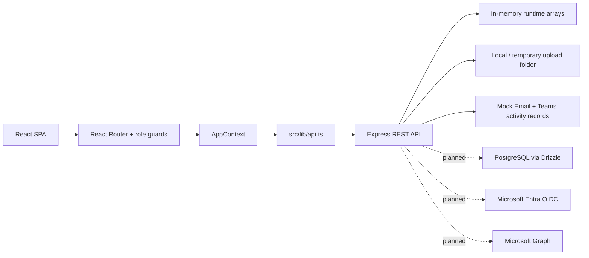

# Sales Reimbursement System — Full System Audit

**Audit date:** August 3, 2026  
**Reviewed commit:** `020d8e1`  
**Repository:** `https://github.com/Jrddlol2/latest-sales-reim-30`  
**Branch:** `main`

## Executive summary

The Sales Reimbursement System is a strong, presentation-ready prototype with functional role-based workflows, coherent desktop UI, useful financial reporting, and a healthy automated baseline.

It is not production-ready for real employee, client, receipt, or financial data.

| Area | Rating | Verdict |
|---|---:|---|
| Demo readiness | 9/10 | Ready for stakeholder presentations |
| UI/UX | 8/10 | Clean and coherent at desktop sizes |
| Feature completeness | 8/10 | Major workflows are implemented |
| Workflow integrity | 6.5/10 | Core happy paths work, but reimbursement transitions need stronger enforcement |
| Automated testing | 7/10 | 61 passing tests; browser E2E and negative cases are missing |
| Maintainability | 6/10 | Understandable, but central files are oversized |
| Security | 3/10 | Prototype identity and attachment authorization are unsuitable for production |
| Production readiness | 3/10 | Authentication, persistence, storage, and operational controls remain blockers |

The repository was clean when audited, and the Git remote correctly pointed to the intended repository.

## Validation results

All standard checks passed:

- TypeScript: passed
- Production build: passed
- Automated tests: **61/61 passed across 9 test files**
- CI runs type-checking, tests, and the production build through `.github/workflows/ci.yml`

Live UI checks confirmed:

- Microsoft-first login and role-based demo launcher
- Requestor dashboard
- Approver queue
- Custodian dashboard and analytics
- Finance approved records, receipts, analytics, and CSV export
- Admin dashboard and reporting
- Client-side role guard preventing a Requestor from opening Admin Reporting
- No application-originated browser console errors during representative checks
- Finance records showed only approved-onward statuses
- Finance tables correctly separated `Expense Total` and `Reimbursed`

The in-app browser verified the login at 1280×720 and the main Finance and Custodian surfaces around 1351×768. A dedicated 1920×1080 acceptance pass is still recommended.

## Technical architecture and integrations

### Technology stack

| Layer | Technology in use | Notes |
|---|---|---|
| Frontend | React 19, TypeScript, Vite 6 | Single-page application in `src/` |
| Routing | React Router 7 | Role-aware routes and client-side route guards |
| Styling | Tailwind CSS 4, `clsx`, `tailwind-merge` | Utility-first styling with shared UI primitives |
| Charts | Recharts | Used for Finance, Custodian, Admin, and team analytics |
| Backend | Node.js, Express 4, TypeScript | REST API concentrated in `server.ts` |
| Development runtime | `tsx` plus Vite middleware | `npm run dev` starts Express and Vite together on port 3000 |
| Production build | Vite and esbuild | Frontend builds to `dist`; Express bundles as `dist/server.cjs` |
| File uploads | Multer | Images, PDF, DOC, and DOCX up to 10 MB |
| Security middleware | Helmet and CORS | Helmet is active, although CSP is intentionally disabled pending a final policy |
| Testing | Vitest and TypeScript compiler | 61 automated tests passed during this audit |
| CI | GitHub Actions | Runs `npm ci`, type-checking, tests, and build on pushes and pull requests |

### Application architecture

The frontend and backend deliberately use different domain shapes. `src/lib/api.ts` is the translation layer that converts server-side reimbursement, cash advance, and liquidation records into the unified frontend claim model. This is a useful boundary to preserve during future database and authentication work.

### Database status — including Supabase

**No, Supabase is not currently connected or used by the running application.** There is no Supabase package, URL, key, client, or authentication integration in this repository.

What does exist:

- A Drizzle ORM PostgreSQL schema in `src/db/schema.ts` with **25 prepared tables**.
- A Drizzle configuration in `drizzle.config.ts` that expects a standard `DATABASE_URL`.
- Generated migration files in `drizzle/`.
- A PostgreSQL client factory in `src/db/index.ts` using `pg` and the legacy ORM.
- Database commands: `npm run db:generate`, `npm run db:push`, and `npm run db:studio`.

What is not connected yet:

- `server.ts` does not use the Drizzle client for business operations.
- Claims, users, MOMs, expenses, receipts, notifications, imports, and settings currently live in in-memory arrays.
- There is no live `DATABASE_URL` requirement for the current demo.
- No data survives a server restart or serverless cold start.

Supabase could be used later as the managed PostgreSQL provider because it supplies a normal Postgres connection string, but it would be an infrastructure choice, not a required rewrite. The existing Drizzle schema can work with Supabase Postgres, Neon, Render Postgres, Azure Database for PostgreSQL, or another compatible managed PostgreSQL service. If Supabase is chosen, do not use its browser client or expose service-role keys for core financial operations; keep business authorization in the Express backend.

### Authentication and Microsoft readiness

| Area | Current implementation | Production target |
|---|---|---|
| Sign-in | Demo account launcher | Microsoft Entra ID authorization-code flow |
| Identity source | Tab-scoped `sessionStorage` plus `X-User-Id` request header | Validated server-side session or token claims |
| Roles | Stored in the application's user records | Keep application roles initially, or formally map Entra groups/app roles later |
| Microsoft button | Microsoft-first visual entry point | Real redirect, callback, session creation, and logout |
| Profile photos | Local demo avatar files | Optional Microsoft Graph fetch/cache/proxy after approval |

The Microsoft configuration contract is prepared through `/api/auth/config` and `/api/auth/microsoft/start`, but it intentionally does not perform SSO yet. Without the required Entra app registration and an approved OIDC adapter, the route returns a clear not-configured or adapter-required response instead of pretending authentication works.

### File storage and document export

- Uploaded files are handled by Multer and stored locally in `uploads/`; Vercel deployments use a temporary directory.
- Accepted files are JPG, PNG, GIF, WEBP, PDF, DOC, and DOCX, with a 10 MB limit.
- This is prototype storage only: it is not durable, and attachment downloads are not yet authorized against the specific claim or MOM that owns the file.
- PDF exports use `jspdf`; Word-compatible exports are generated in the browser as `.doc` files.

### Notifications and external integrations

- Internal notification events currently create in-memory outbox records and mock Microsoft Teams records.
- The mock transport logs messages rather than delivering them through Microsoft Teams, Microsoft Graph, SMTP, or another real provider.
- Client CC messages are represented in the workflow, but production delivery needs a real, approved mail integration.
- There is no current Microsoft Graph, SharePoint, SAP, HRIS, or calendar integration.

### Deployment and environment configuration

- `vercel.json` prepares the project for a Vercel serverless API plus static frontend deployment. This confirms deployment configuration exists; it does not prove a live Vercel environment is currently configured.
- Local development uses `npm run dev` and serves the application on `http://127.0.0.1:3000`.
- The main planned environment variables are `DATABASE_URL`, `DEMO_MODE`, `AUTH_MODE`, `ENABLE_DEMO_LOGIN`, `AUTO_SEED`, and the Microsoft Entra registration values.
- There is currently no health/readiness endpoint, centralized production logging, monitoring, or error-tracking service.

## What works well

- Role navigation is clear and appropriately differentiated.
- Demo accounts use tab-scoped sessions, making multi-role live presentations practical.
- Frontend role protection is implemented in `src/App.tsx`.
- Finance is centrally blocked from financial mutations and receives approved-onward records only.
- Cash Advance and Liquidation endpoints generally enforce valid source statuses.
- Expense totals and reimbursed amounts are meaningfully separated.
- Finance analytics use useful accounting concepts: claimed, approved, paid, and outstanding.
- CSV financial export is present.
- Receipt search and filtering cover useful financial fields.
- Client-CC awareness is tested for the Requestor and Approver.
- The 30-day filing rule, ₱1,000 reimbursement cap, assigned-approver authority, cash-only reimbursement release, and incorrect release-code rejection have automated coverage.
- The current `README.md` and `docs/AI-HANDOFF-CONTEXT.md` provide a substantially better handoff than the older documentation.

## Prioritized findings

| Severity | Finding | Impact | Recommendation |
|---|---|---|---|
| Critical | Identity is trusted through `X-User-Id` | Anyone who can call the API can impersonate another demo user, including an Administrator | Replace it with Microsoft Entra authorization-code flow, validated server sessions, and server-derived identity |
| Critical | Runtime data is stored in arrays | Every restart or cold start loses transactions; multiple instances cannot share state | Complete the PostgreSQL/Drizzle migration before using real data |
| Critical | Current dependency audit reports one critical and two high vulnerabilities | `jspdf` and `react-router` are within affected version ranges | Perform targeted upgrades and regression testing; do not blindly run `npm audit fix --force` |
| High | Reimbursement approval lacks a current-status check | A completed, rejected, returned, or already-approved reimbursement can potentially be approved again through the API | Require `Pending Approval` before any Approve, Return, or Reject mutation |
| High | Custodian claim-code and ready-for-claim endpoints lack transition guards | A Custodian can potentially issue a code or mark an inappropriate record ready out of sequence | Require `Processing`, validate custodian assignment if introduced, and make transitions idempotent |
| High | Release codes use `Math.random()` and have no expiry or attempt throttling | Codes are not cryptographically generated, arbitrary custom codes are accepted, and confirmation attempts are unlimited | Use `crypto.randomBytes`, fixed server validation, expiry, hashed storage, regeneration invalidation, and throttling |
| High | Attachment access is not claim-scoped | Any authenticated identity that knows a filename and user ID can retrieve another claim’s receipt or MOM file | Move files to private object storage and authorize every download against the linked record |
| High | Claim submission is a non-transactional sequence of uploads, MOM creation, and claim creation | A later failure can leave orphaned uploads or MOM records | Implement a database transaction and upload cleanup or compensation |
| Medium | Every page loads a large workspace through approximately 15 requests | Full users, claims, advances, liquidations, settings, companies, support, and other collections are loaded even when not needed | Introduce route-level queries, pagination, caching, and server-side filtering |
| Medium | All authenticated roles receive the complete user collection and Admin settings | This exposes more personnel and configuration data than most roles need | Return minimal directory projections and restrict settings to Admin or a public policy projection |
| Medium | Profile editing displays success without persisting changes | Change Photo and Save Changes create misleading success messages | Disable them with an honest Microsoft-managed explanation or implement actual persistence |
| Medium | CSP is disabled and operational controls are absent | Production deployment lacks CSP, rate limiting, structured logging, monitoring, and health checks | Add these after the final hosting and authentication architecture is selected |
| Medium | Important negative workflow cases lack automated coverage | The test suite validates happy paths but misses replay and out-of-order financial actions | Add a server-side transition-matrix test suite |
| Low | Documentation has competing source-of-truth files | Older audits contain findings that have since been fixed | Archive or clearly mark older audits as historical |
| Low | Major files are oversized | `server.ts` is 6,198 lines, `src/lib/api.ts` is 1,395, and `SubmitClaim.tsx` is 1,071 | Split by domain after production contracts stabilize |

The highest-risk workflow problem is visible around the reimbursement approval mutation and the Custodian claim-code and ready-for-claim mutations in `server.ts`. Cash Advance and Liquidation already demonstrate the correct pattern by explicitly checking their source statuses.

## Role-by-role audit

### Requestor

Strengths:

- Clear dashboard and New Claim entry point
- Reimbursement, Transport Reimbursement, Cash Advance, and Liquidation
- Multiple expense rows and receipts
- MOM and client-contact flow
- Payout confirmation and status tracking
- Search, notifications, support, and settings

Remaining work:

- Make submission transactional.
- Persist or disable the fake profile-editing actions.
- Add complete keyboard and screen-reader testing for the multi-step claim form.

### Approver

Strengths:

- Oldest-first approval queue
- Quick actions and history
- Return and reject reasons
- Review meeting scheduling
- Delegation and approver-transfer support
- Team-oriented dashboards

Remaining work:

- Enforce `Pending Approval` on the server before decisions.
- Add double-submit and replay protection.
- Test completed, rejected, and returned claims being acted on again.

### Custodian

Strengths:

- Processing, ready-to-claim, transaction history, and analytics
- Return and reject-before-release behavior
- Cash-only reimbursement enforcement
- Release-code flow

Remaining work:

- Restrict claim-code generation and ready-for-claim to `Processing`.
- Harden release codes.
- Clarify exactly when `paid_at` should be recorded: physical release, ready-for-claim, or Requestor confirmation.

### Finance

Strengths:

- Correct read-only role
- Approved-onward company-wide visibility
- Receipts and paid/completed history
- Finance-specific analytics
- CSV export
- Correct separation of expense, approved, paid, and outstanding values

The selected chart types are appropriate:

- Time-series for monthly obligations and releases
- Horizontal bars for category, department, and Requestor comparisons
- Status counts for operational distribution
- Drill-down table beneath the charts

Remaining work:

- Validate every metric definition with the Finance owner.
- Export the metric contract alongside reports.
- Add server pagination before production-scale data.

### Administrator

Strengths:

- Users, companies, imports, reporting, system activity, and demo-data controls
- Demo seed and reset surfaces are gated by demo mode
- Historical CSV import is functional rather than simulated

Remaining work:

- Move configuration and imports to persistent storage.
- Restrict Admin settings responses.
- Add import preview, duplicate handling, rollback, and durable batch logs.
- Connect organization data to the approved Entra or HR source.

## Workflow audit

### Reimbursement

The happy path is functional and covered by automated tests:

1. Requestor files a reimbursement with expenses and receipts.
2. The designated Approver approves, returns, or rejects it.
3. A Custodian processes the approved reimbursement.
4. The Custodian generates a release code and marks it ready.
5. The Requestor confirms receipt using the code.

The primary defect is that the reimbursement-specific approval and Custodian routes do not enforce their expected source statuses. This permits potential replay and out-of-order mutations through direct API calls.

### Cash Advance

Cash Advance submission, approval, release, and history mapping are functional. The server correctly restricts decisions to `Submitted` advances and releases to `Approved` advances.

### Liquidation

Liquidation submission, return, review, settled closure, refund-due handling, and reimbursement-due handling are implemented. The review endpoint correctly limits actions to `Submitted` liquidations.

### MOM and client CC

Standalone and claim-linked MOM records are implemented. Client contact details and client-CC awareness notifications are present. Current email records are mock or in-app outbox data rather than external delivery.

## UI/UX audit

The visual system is consistent and substantially less template-driven than earlier versions:

- Login hierarchy is clear and Microsoft sign-in remains primary.
- The blue-forward login layout looks branded rather than generic.
- Animated background elements are decorative and do not interfere with legibility.
- Sidebar navigation changes sensibly by role.
- Sign out is appropriately contained in the profile menu.
- Tables use meaningful status badges and aligned financial columns.
- Filters are compact enough for the primary desktop targets.
- Finance and Admin analytics expose source records beneath visual summaries.

Remaining UX work:

- Complete 1920×1080 role-by-role verification.
- Run a formal keyboard and screen-reader pass.
- Replace misleading success-only profile controls.
- Verify all modal focus behavior and Escape handling.
- Test empty, loading, error, and very large dataset states in the browser.

## Production blockers

The following must be completed before a real deployment:

1. PostgreSQL persistence and database transactions
2. Microsoft Entra OIDC and signed server sessions
3. Removal of `X-User-Id` and URL-based `uid` attachment access
4. Private object storage with record-level authorization
5. Dependency vulnerability remediation
6. Strict workflow transition enforcement
7. Secure release-code implementation
8. Real notification delivery and retry handling
9. Rate limiting, CSP, structured logs, monitoring, and health/readiness endpoints
10. Backup, restore, retention, and audit-log policy
11. Staging UAT with sanitized production-like data
12. Privacy and security review for receipts and employee information

Microsoft profile photos are not automatic. They require approved Microsoft Graph permission and an authenticated backend proxy or cache, as documented in `docs/microsoft-auth-handoff.md`.

## Recommended roadmap

### P0 — Immediate risk reduction

1. Patch the vulnerable dependencies.
2. Add a formal reimbursement transition matrix.
3. Enforce status guards on approval, claim-code, and ready-for-claim endpoints.
4. Harden release codes.
5. Add regression tests for replay and out-of-order actions.

### P1 — Production foundation

1. Migrate all arrays to PostgreSQL.
2. Make claim creation atomic.
3. Implement Entra authentication and server sessions.
4. Move attachments to private object storage.
5. Add attachment ACLs and operational security controls.

### P2 — Product and UX completion

1. Replace fake profile saves.
2. Add real notification delivery.
3. Add pagination and server-side search.
4. Complete accessibility and keyboard testing.
5. Verify 1366×768 and 1920×1080 across all roles.
6. Archive stale documentation.

## Required test additions

- Re-approving an already approved or completed claim
- Returning or rejecting a non-pending claim
- Issuing a claim code for a non-processing claim
- Marking a rejected or draft claim ready for payout
- Release-code expiry, regeneration, and brute-force throttling
- Attachment access by unrelated Requestor, Approver, Finance, and Custodian accounts
- Partial failure during upload, MOM, and claim creation
- Concurrent approval and release actions
- Entra callback, session, logout, and expiry behavior
- Finance scope and export consistency
- Browser E2E for all five roles
- Automated accessibility scan and keyboard-only flows
- Load testing with at least 10,000 financial records

## Final verdict

Continue using the system for demonstrations and stakeholder review. Do not load real financial documents or employee data until the P0 and P1 work is complete.
